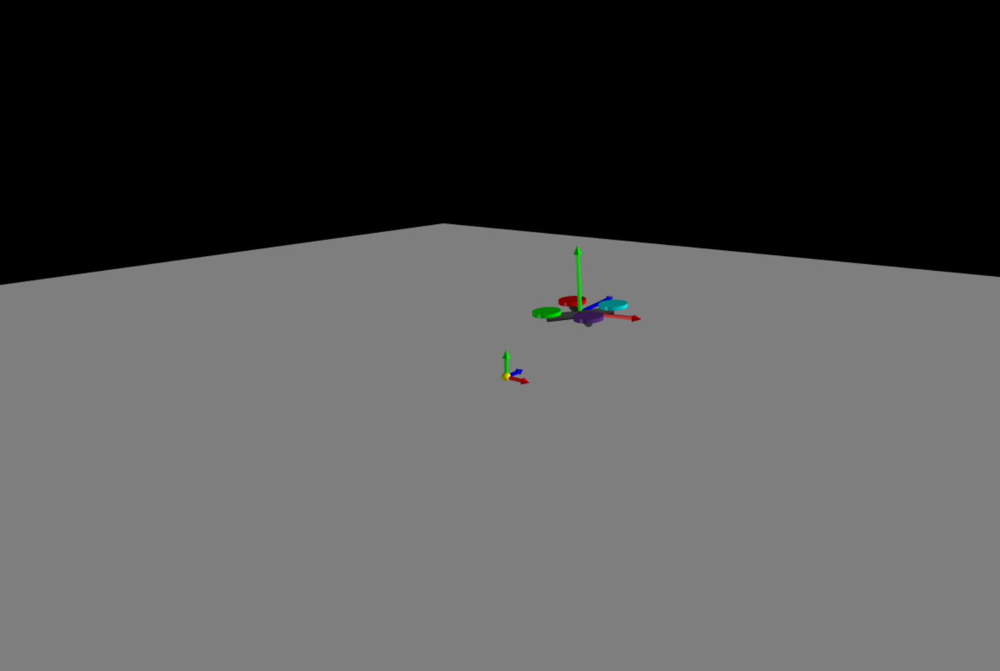
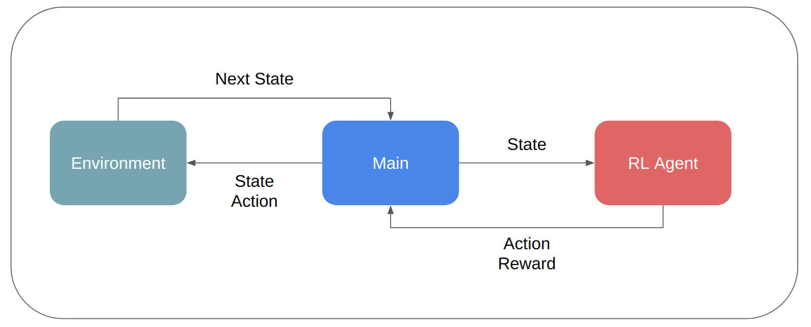

# 3D Robotics Simulator in OpenAI Gym Environment

### Authors: Tianyu Li (Anthony), Weizhuo Wang (Ken)

This is an OpenAI gym simulation environment designed for Reinforcement Learning(RL) agent training. The repo itself contains the common framework structure for RL training and the simulator. An example of a quadrotor environment and RL agent is given. To use this repo with customization, users should:
1. Enter the learning algorithm in <strong>Agent.py</strong>.
2. Provide simulation rendering vpython model in <strong>gym_quadrotor/envs/quadrotor_env.py</strong>.
3. Provide reward function in <strong>Agent.py</strong>.

##### Screenshot

##### Block Digram

##### Requirements:
- gym
- vpython
- matplotlib
- numpy

##### Running Instructions:

1. In root directory, activate python3 virtual environment
> source venv/bin/activate

2. Install Requirements Package (only for the first time)
> pip3 install -r requirements.txt

3. Run the gym environment
> python3 main.py

##### Important files:

|#| File Name          | Description     |
|-| ------------- |-------------|
|1| main.py    | Main running file |
|2| Agent.py    | RL network file |
|3| gym_quadrotor/envs/quadrotor_env.py | Simulator environment |
